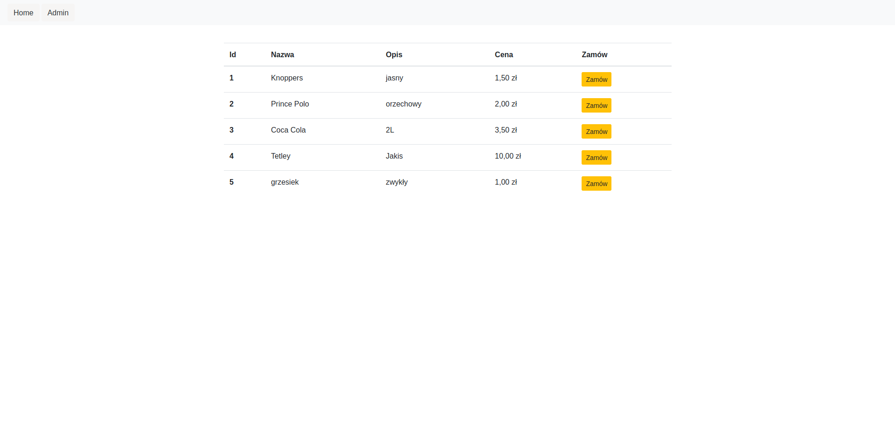
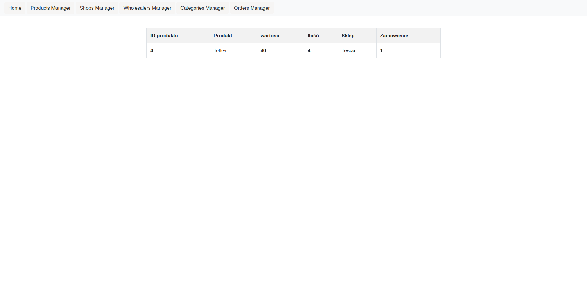
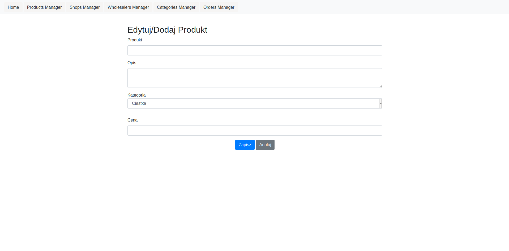
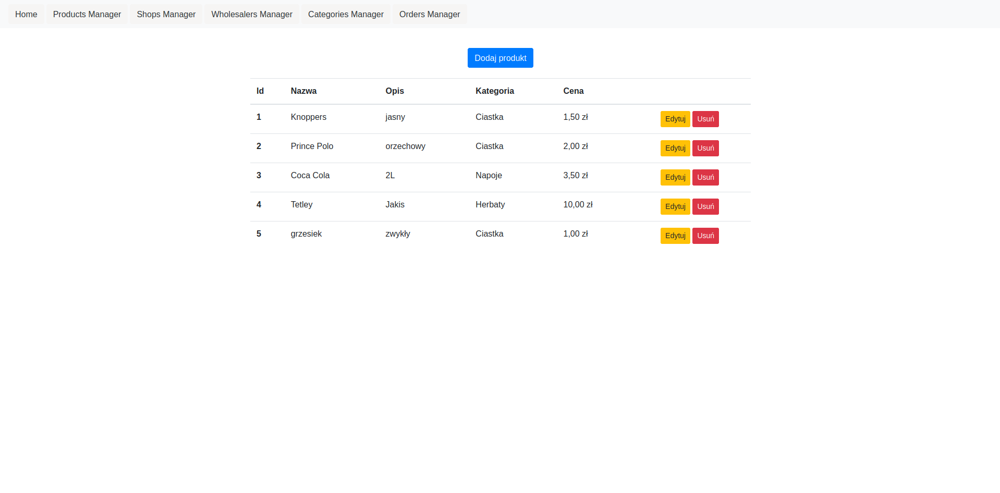
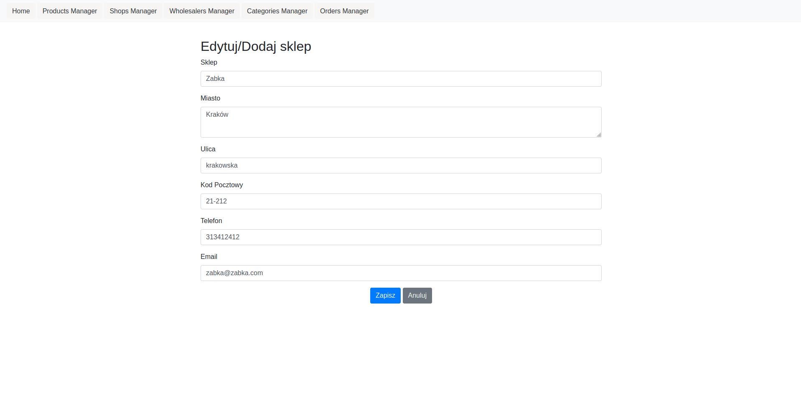

# Wholesaler Web App 

## Table of contents
* [General info](#general-info)
* [Technologies](#technologies)
* [Setup](#setup)
* [Author](#author)
* [Screenshots](#screenshots)

## General info
**This project is an app for shop owners to buy items from wholesaler and for wholesalers to manage products in warehouses and check orders created with .Net Core**

## Technologies
Project is created with:
* .Net 5.0
* Entity Framework Core
* Sqlite
* Asp.Net Core
* Boostrap

## Setup
To open and run this project, follow this commands:
1. git clone https://github.com/Miatosz/Wholesaler.git
2. cd .\Wholesaler\
3. dotnet run

Then you can open app in browser on port **5001*(https://localhost:5001/)*

## Author
* **[Marcin Drelewski](https://github.com/Miatosz)**
* **email:** drelewskiim@gmail.com

## Screenshots

